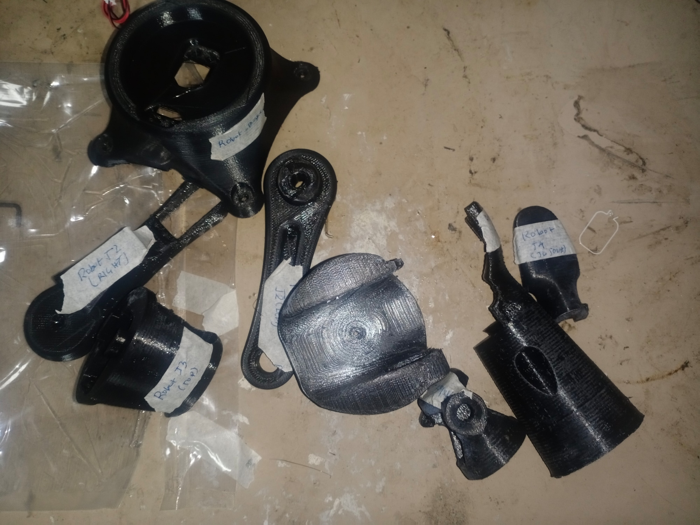
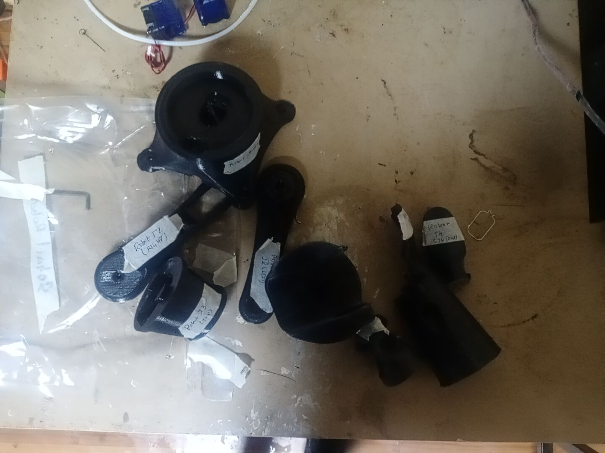

# Expenses

## [2022-05-9](journal/2022-05-9.md)

### For bus 
- form __Jaya nagar to Town hall__   2*15 = 30
- form __Town to hall to kumarhosue__ 1*20 = 20
- form __Town hall to hoskerhalli__ 1*20 = 20
- ___Total___ = 70
---

## [2022-05-17](journal/2022-05-17.md)

### For Motor
- Micro Servo MG90S 2*180 = 360
- Servo MG995 4*350 = 1,400
### For Bus 
- form __Jaya nagar to Town hall__   2*15 = 30
- form __Town to hall to kumarhosue__ 1*20 = 20
- form __Town hall to hoskerhalli__ 1*20 = 20
- ___Total___ = 1760+70 = 1,830
---

## [2022-05-31](journal/2022-05-31.md)

### For 3d-printed parts
- 8 parts 4000
-  
---
## GrandTotal
 - 5900