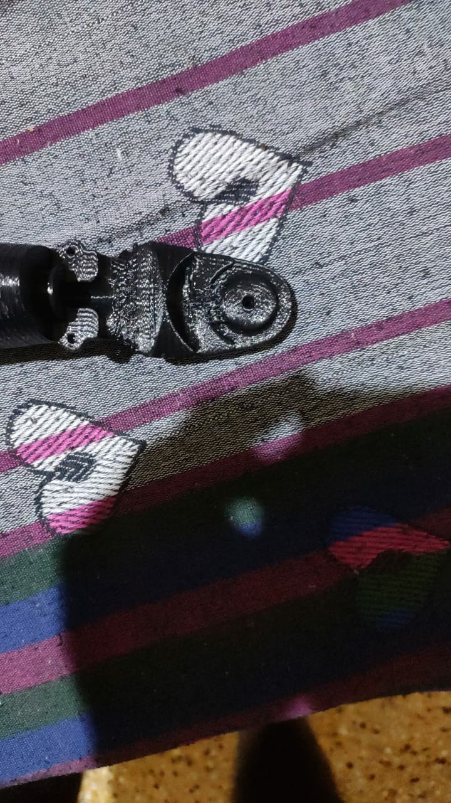

# 1
- we had to re-render .stl file to get 3d parts more accurate finishing
 
- one parts has been printed without groove to solve we drilled it for groove
and somme unaccurate parts needed our hand finishing to fit correctly
# 2
Due to FDM printing we can not get exact hole to fit the motor spindle No matter how tight we connect the part to spindle it has eventutialy got into slippery connection so without solving we can't move ahead.
we solved this by insert nut technique use in carpentry to fasten 
but we didn't used insert nut.
instred cutted the pulley which come along with motor pack and by using soltring gun to mounted it holes.
     

